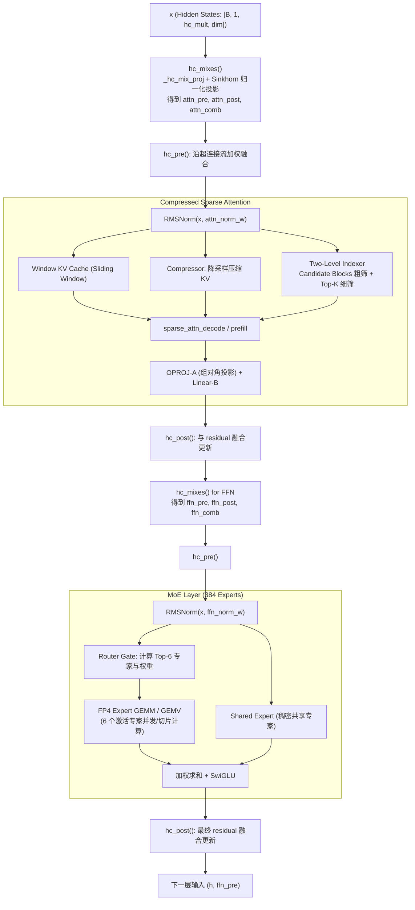
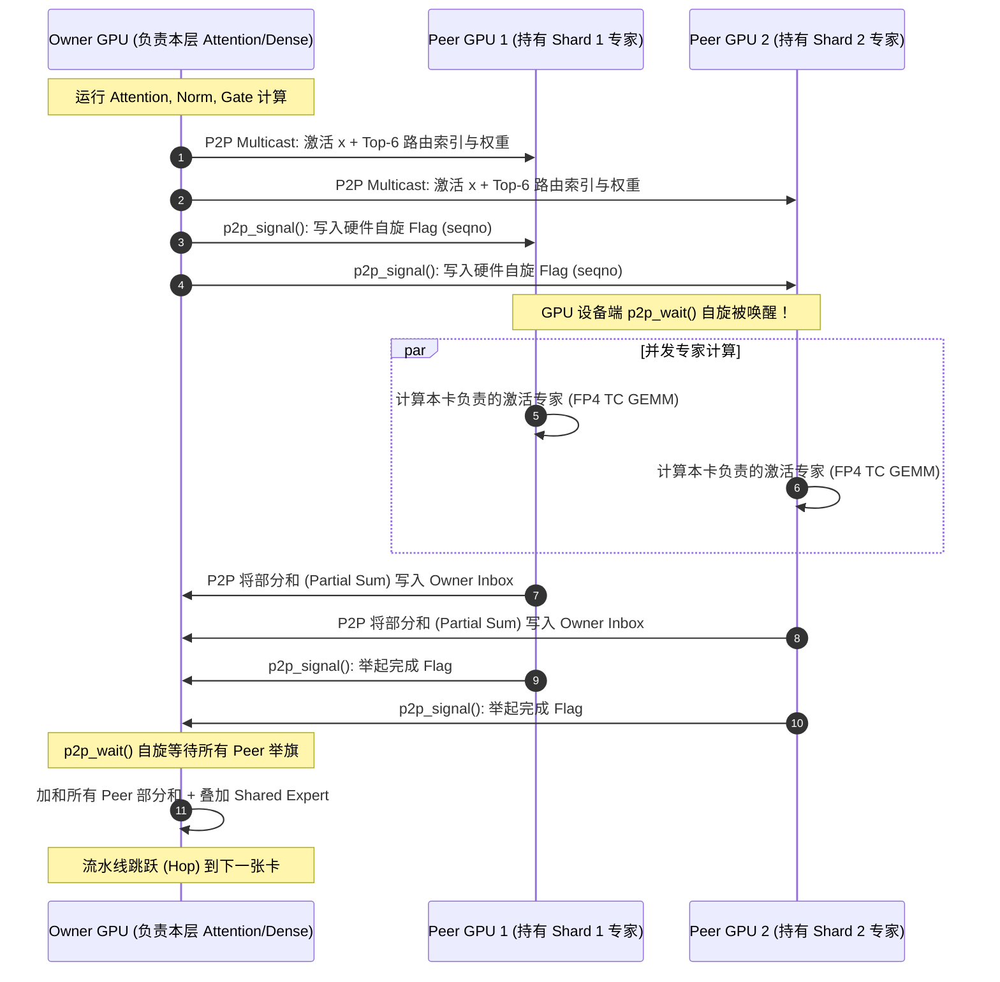

# DeepSeek-V4.1-Flash A100 自研推理引擎深度架构分析

> 本文基于项目源码（`dsv41/`）与技术文档，深度剖析专为 8× A100 (sm80) 架构打造的从零自研推理引擎。结合 [docs/dev.md](file:///Users/wanghaibing/code/ai/deepseekv4.1-A100-custom/docs/dev.md) 中的底层性能思考，系统性解析其**系统架构**、**模型加载与内存调度**、**执行与解码流程**以及**突破硬件限制的算子级黑魔法**。

---

## 目录
- [1. 项目定位与核心设计哲学](#1-项目定位与核心设计哲学)
- [2. 整体系统架构与模块拓扑](#2-整体系统架构与模块拓扑)
- [3. DeepSeek-V4.1-Flash 模型载入与内存布局深度剖析](#3-deepseek-v41-flash-模型载入与内存布局深度剖析)
  - [3.1 零拷贝 Safetensors 加载与格式抽象 (`stio.py`)](#31-零拷贝-safetensors-加载与格式抽象-stiopy)
  - [3.2 内存预算与分层放置策略 (`load.py`)](#32-内存预算与分层放置策略-loadpy)
  - [3.3 专家权重布局与 Tiling 重排 (`quant.py`, `w8.py`)](#33-专家权重布局与-tiling-重排-quantpy-w8py)
  - [3.4 Engram 条件记忆表的主机驻留与查表机制 (`engram.py`)](#34-engram-条件记忆表的主机驻留与查表机制-engrampy)
- [4. 执行引擎与前向计算流 (Forward & Execution Flow)](#4-执行引擎与前向计算流-forward--execution-flow)
  - [4.1 核心网络架构与算子流 (`model.py`)](#41-核心网络架构与算子流-modelpy)
  - [4.2 静态形状自回归解码与 CUDA Graph 录制 (`decode.py`)](#42-静态形状自回归解码与-cuda-graph-录制-decodepy)
  - [4.3 专家并行 (EP) 与设备级零 Host 往返调度 (`ep.py`)](#43-专家并行-ep-与设备级零-host-往返调度-eppy)
  - [4.4 单卡 CPU 异构计算与 NUMA 核心亲和绑定 (`cpumoe.py`, `moe_cpu.cpp`)](#44-单卡-cpu-异构计算与-numa-核心亲和绑定-cpumoepy-moe_cpucpp)
  - [4.5 DSpark 多 Token 投机预测 (MTP) 执行流水线 (`mtp_run.py`, `dspark.py`)](#45-dspark-多-token-投机预测-mtp-执行流水线-mtp_runpy-dsparkpy)
- [5. 针对 A100 (SM80) 的硬件级加速黑魔法](#5-针对-a100-sm80-的硬件级加速黑魔法)
  - [5.1 无原生 FP4/FP8 硬件单元下的寄存器位操作与指数折叠](#51-无原生-fp4fp8-硬件单元下的寄存器位操作与指数折叠)
  - [5.2 消除原子操作的 GEMV 与 Grouped GEMM 访存局部性重构](#52-消除原子操作的-gemv-与-grouped-gemm-访存局部性重构)
  - [5.3 基于硬件原子自旋标志 (Device-side Spin Flags) 的 P2P 跨卡同步](#53-基于硬件原子自旋标志-device-side-spin-flags-的-p2p-跨卡同步)
- [6. 架构评析与最佳实践启示 (Review & Takeaways)](#6-架构评析与最佳实践启示-review--takeaways)

---

## 1. 项目定位与核心设计哲学

在标准的大模型推理方案中，Hugging Face Transformers、vLLM 或 SGLang 依赖硬件原生的数据类型支持（如 NVIDIA Ada/Hopper/Blackwell 上的 FP8 与 FP4 Tensor Cores）。面对 **DeepSeek-V4.1-Flash**（552B MoE 主干 + 196B Engram 条件记忆表，原生采用 FP8 稠密权重与 FP4 专家权重）：
- **硬件代差**：NVIDIA A100 (Ampere sm80) 完全没有硬件 FP8 与 FP4 算力单元；
- **官方生态缺位**：官方未提供 Ampere 适配，通用引擎跑原生权重要么显存严重溢出，要么因通用模拟极其缓慢；
- **显存墙极限**：单卡 80GB VRAM 无法容纳 269 GiB 的 FP4 专家权重与 189 GiB 的 Engram 表。

本项目并未修改模型权重本身，而是构建了一个**从零实现的专用 Reference Runtime**：
1. **纯自研算子栈**：仅将官方 `inference/model.py` 作为数学定义参考，所有计算内核均基于 Triton 与手写 CUDA C（编译为 cubin 后通过 ctypes Driver API 调用，绕过 PyTorch 的 dispatch overhead 并支持无缝录制 CUDA Graph）；
2. **极速异构内存调度**：将 189 GiB 的 Engram 表与冷专家放置在 Host RAM，通过极小激活流经 PCIe 甚至直接在 CPU 端以 AVX-512 VNNI 计算；
3. **消除 CPU 指令开销 (Kernel Launch Bound)**：通过静态 Shape、Dummy 行填充、设备端自旋通信（Device-side P2P Spin Flags），将自回归解码编译为**每张卡单一完整的 CUDA Graph**，实现单 Token 解码零 Host 往返（Zero Host Round-trip）；
4. **位操作数学魔术**：在 sm80 寄存器内利用位移、位掩码与浮点乘加（`fma.rn.bf16x2`），精确把 FP4/FP8 伪装并反量化为 BF16，输入 Tensor Core 的 `mma.sync` 累加。

---

## 2. 整体系统架构与模块拓扑

整个引擎由以下几个核心层次构成：

```mermaid
flowchart TB
    subgraph ClientAndServing ["1. 接口与服务层 (Serving Layer)"]
        CLI["dsv41/run.py<br/>(One-shot CLI & Profiler)"]
        Chat["dsv41/chat.py<br/>(Terminal REPL)"]
        Serve["dsv41/serve.py<br/>(OpenAI-Compatible HTTP Server)"]
    end

    subgraph GenerationCore ["2. 调度与生成引擎 (Generation Engine)"]
        Engine["dsv41/engine.py (Engine)<br/>Tokenizer / Sampling / Stream / MTP Policy"]
        MTP["dsv41/dspark.py (DSparkRows)<br/>Multi-Token Speculative Drafting"]
    end

    subgraph RuntimeExecution ["3. 执行运行时 (Decode Runtime)"]
        PlainDecode["dsv41/decode.py (DecodeRuntime)<br/>Layer-Pipeline CUDA Graph"]
        EPRuntime["dsv41/ep.py (EPRuntime)<br/>Expert Parallelism + P2P Spin Graphs"]
        OffloadRuntime["dsv41/decode.py (OffloadDecodeRuntime)<br/>GPU Dense + CPU MoE Heterogeneous"]
    end

    subgraph ModelLayer ["4. 架构与算子流 (Model & Operator Flow)"]
        Trans["dsv41/model.py (Transformer / Block)<br/>40 Layers Pipeline"]
        Attn["Compressed Sparse Attention<br/>Sliding Window + 2-Level Indexer + FP4 KV"]
        HC["Hyper-Connections (HC)<br/>Multi-stream Residuals + Sinkhorn Pre/Post Mix"]
        MoELayer["MoE Dispatcher (384 Experts)<br/>Top-6 Routed + Shared Expert"]
    end

    subgraph MemoryAndStorage ["5. 内存与权重载入 (Memory & Checkpoint IO)"]
        STIO["dsv41/stio.py (Checkpoint)<br/>Mmap Safetensors Zero-Copy Slicing"]
        Load["dsv41/load.py<br/>Greedy Placement, W8 Packing, Tiling"]
        EngramMem["dsv41/engram.py (HostEngramTable)<br/>189 GiB Host RAM Resident + N-Gram Hash"]
        CPUMoEMem["dsv41/cpumoe.py (HostExperts)<br/>NUMA Bound Host RAM + AVX-512 VNNI"]
    end

    ClientAndServing --> GenerationCore
    GenerationCore --> RuntimeExecution
    RuntimeExecution --> ModelLayer
    ModelLayer --> MemoryAndStorage
```



### 核心模块映射表

| 文件 | 核心功能 | 解决的关键工程问题 |
|---|---|---|
| [dsv41/stio.py](file:///Users/wanghaibing/code/ai/deepseekv4.1-A100-custom/dsv41/stio.py) | 极致轻量的 `mmap` Safetensors 读取器 | 规避 PyTorch 不支持 `F8_E8M0` 导致的内存复制，支持首维快速 Row Slicing |
| [dsv41/quant.py](file:///Users/wanghaibing/code/ai/deepseekv4.1-A100-custom/dsv41/quant.py) | E8M0 / FP8 / E2M1 数值格式定义与 Tiling | 定义 Ampere 上的模拟对齐与 Tile 排布，重塑专家与权重内存访问模式 |
| [dsv41/load.py](file:///Users/wanghaibing/code/ai/deepseekv4.1-A100-custom/dsv41/load.py) | 显存/内存预算规划、贪心多卡放置与转换 | 自动分配每卡层数，加载 Packed FP4，拆分 Dense W8，部署 Engram 到 Host RAM |
| [dsv41/model.py](file:///Users/wanghaibing/code/ai/deepseekv4.1-A100-custom/dsv41/model.py) | DeepSeek-V4.1-Flash 网络前向与层逻辑 | 40 层流水线、超连接 (HC) Sinkhorn 混合、压缩稀疏注意力 (Two-level Indexer)、MoE |
| [dsv41/decode.py](file:///Users/wanghaibing/code/ai/deepseekv4.1-A100-custom/dsv41/decode.py) | 静态形状解码引擎与 CUDA Graph 捕获 | 消除动态条件分支，使用 Dummy 行吸纳无效写，每卡录制整图 |
| [dsv41/ep.py](file:///Users/wanghaibing/code/ai/deepseekv4.1-A100-custom/dsv41/ep.py) | 专家并行 (EP) 运行时 | 稠密层流水线 + 专家全卡 Sharding，设备端 P2P 自旋同步，整 Token 零 Host 调度 |
| [dsv41/cpumoe.py](file:///Users/wanghaibing/code/ai/deepseekv4.1-A100-custom/dsv41/cpumoe.py) | Host MoE 异构调度与 NUMA 绑定 | 协调 C++ AVX-512 VNNI 多线程执行冷专家，支持 Hot Expert GPU 缓存 |
| [dsv41/cuda/](file:///Users/wanghaibing/code/ai/deepseekv4.1-A100-custom/dsv41/cuda/) | 手写 CUDA C 算子（`fp4_gemv`, `fp4_tc`, `p2p`, 等） | sm80 寄存器级 FP4/FP8 反量化与 Tensor Core GEMM，无原子累加的并行 GEMV |
| [dsv41/fused.py](file:///Users/wanghaibing/code/ai/deepseekv4.1-A100-custom/dsv41/fused.py) & [fused2.py](file:///Users/wanghaibing/code/ai/deepseekv4.1-A100-custom/dsv41/fused2.py) | Triton 算子融合 | 融合 RMSNorm + FakeQuant + RoPE + Sinkhorn + SwiGLU，压缩启动开销 |

---

## 3. DeepSeek-V4.1-Flash 模型载入与内存布局深度剖析

大模型工程中，**权重物理布局与载入策略直接决定了推理引擎的内存上限与访存速度**。

### 3.1 零拷贝 Safetensors 加载与格式抽象 (`stio.py`)
官方权重包含 `F8_E8M0`（指数只有 8 位，无尾数）、`F8_E4M3` 以及按 Nibble 紧凑打包的 `I8`。标准 PyTorch `safetensors.torch.load_file` 在遇到不被原生支持的数据类型或超大文件（189 GiB 的 Engram 表）时，往往会强制抛错或发生全量 Host 内存深拷贝，导致 OOM。

[dsv41/stio.py](file:///Users/wanghaibing/code/ai/deepseekv4.1-A100-custom/dsv41/stio.py) 的解决策略非常优雅：
1. **只解析 Header 与 Offset**：只读 Safetensors 开头的 8 字节长度及 JSON Header，得到每个张量的 `data_offsets`；
2. **底层基于 `np.memmap` 虚拟映射**：保持只读 mmap，不对文件做立即装载；
3. **零拷贝类型借调**：
   ```python
   # F8_E8M0 和 packed 权重直接映射为 uint8 视图，不触发任何格式报错或数据移动
   TORCH_DTYPE = {
       "F8_E4M3": torch.float8_e4m3fn,
       "F8_E8M0": torch.uint8,
       "I8": torch.int8,
       "BF16": torch.bfloat16,
       ...
   }
   ```
4. **切片式首维读取 (`rows: slice`)**：当只需提取张量前一部分数据时，直接按字节步长偏移切出 `buf[base + start : base + end]`，通过 `torch.frombuffer(memoryview(buf))` 封装为 Tensor，按需传至 GPU。

### 3.2 内存预算与分层放置策略 (`load.py`)

完整的 DeepSeek-V4.1-Flash 模型如果全部塞入显存需要超过 **480 GiB**，单张 80GB 卡不可能装下。`load.py` 建立了一套严密的物理资源拓扑预算表：

```
+-----------------------------------------------------------------------------------+
| 全局物理资源划分 (8× A100 80GB + 256GB+ Host RAM)                                 |
+-----------------------------------------------------------------------------------+
| 1. Routed Experts (384 × 40 layers): ~269 GiB (FP4 Packed + E8M0 scale)           |
|    - Pipeline 模式: 随 Layer 放置在拥有该 Layer 的 GPU (每层 ~6.72 GiB)            |
|    - EP 模式: 每一层 384 个专家水平切分在各 GPU (如 4卡: 100, 100, 100, 84)       |
|    - CPU Offload 模式: 常驻 Host RAM，仅通过 PCIe 传输激活或使用 CPU 计算          |
+-----------------------------------------------------------------------------------+
| 2. Dense Weights: 13.6 GiB (每层 0.34 GiB, Attention, Shared Expert, Indexer)    |
|    - FP8 格式以 W8 封装常驻 GPU，计算时在寄存器反量化为 BF16 或预解包为 BF16      |
+-----------------------------------------------------------------------------------+
| 3. Embeddings & LM Head: 2.5 GiB                                                  |
|    - 分别放置在第一张卡 (Dev0) 和最后一张卡 (DevL)                                 |
+-----------------------------------------------------------------------------------+
| 4. Engram Tables (Layer 1 与 Layer 14): 2 × 94.5 GiB = 189 GiB                    |
|    - 强行驻留于 Host RAM (HostEngramTable)，通过 GPU Hash 异步采集查表            |
+-----------------------------------------------------------------------------------+
```

#### 贪心层放置算法 (`plan_placement`)
在非 EP 模式下，系统根据各 GPU 的实际空闲显存（`torch.cuda.mem_get_info`）或指定的 `--budgets`，按顺序填满每张卡：
```python
layer_gb = LAYER_GB_OFFLOAD if offload else LAYER_GB # 正常 7.1 GiB，offload 仅 0.25 GiB
reserve = RESERVE_GB_OFFLOAD if offload else RESERVE_GB # 保留工作区显存
for d in devices:
    # 考虑第一张卡额外持有 Embedding (2.6 GiB)
    n = int(max(0, free[d] - reserve - (2.6 if d == devices[0] else 0)) // layer_gb)
    for _ in range(n):
        placement.append(torch.device(f"cuda:{d}"))
```

### 3.3 专家权重布局与 Tiling 重排 (`quant.py`, `w8.py`)
在最初版本中，Ampere 运行 FP4 GEMM 时，Nsight 工具显示带宽利用率仅有 46%，瓶颈在于 `long_scoreboard` 停顿：因为一个 Warp 在处理 128-k 步长时，读取 8 行 × 64 字节是分散在内存各处的。

作者在 [dsv41/load.py](file:///Users/wanghaibing/code/ai/deepseekv4.1-A100-custom/dsv41/load.py) 和 [dsv41/quant.py](file:///Users/wanghaibing/code/ai/deepseekv4.1-A100-custom/dsv41/quant.py) 中引入了**权重 Tiling 重排 (`tile_fp4`)**：
- 将专家权重重新组织为：`[N/16][K/128][16 rows][64 B]`；
- Scales 同样对齐打包：`tile_fp4_scales`；
- 这一改动使 HBM 读取转变为完全连续的 16 字节 Vectorized Load，使得 FP4 算子在 1 Token/Expert 时的有效带宽从 1.02 TB/s 猛增到 **1.46 TB/s**，逼近 A100 的 1.55 TB/s 硬件物理极限！

### 3.4 Engram 条件记忆表的主机驻留与查表机制 (`engram.py`)
Engram 结构通过大容量 N-gram 查找表赋予模型超大参数容量（类似记忆外挂）。两层（Layer 1 和 14）共有 **189 GiB**。
- **存储**：完全留在 Host RAM（`HostEngramTable`：uint8 存储的 `float8_e4m3fn` 行与 `scale_u8`）；
- **执行**：
  1. GPU 侧通过输入 Token 计算多头压缩哈希值（`NgramHashState`）；
  2. 将单步需要的几百个索引（仅约 12 KB）发回 CPU；
  3. CPU 调用高效的 `torch.index_select` 提取行与尺度；
  4. 异步 `.pin_memory().to(device, non_blocking=True)` 拷贝上卡并在 GPU 上还原为 BF16；
  5. 整个过程仅耗时约 1 ms，成功让 189 GiB 的庞然大物在单机内存中高效运转。

---

## 4. 执行引擎与前向计算流 (Forward & Execution Flow)

### 4.1 核心网络架构与算子流 (`model.py`)

DeepSeek-V4.1-Flash 的单个 Block 计算流程极其紧密：



#### 超连接机制 (Hyper-Connections, HC)
区别于标准 Transformer 的单一残差线，该模型在特征流中维持了 `hc_mult` 个流（如 4 路）。在每一层 Attention 和 FFN 的前后，调用 `hc_split_sinkhorn`：
- 先经过线性投影与标准差缩放，得到各流的混合权值；
- 利用 Sinkhorn 迭代生成双随机/正定分布权重；
- 在执行子层计算前混合各流（`hc_pre`），并在执行后与原残差流进行非线性组合（`hc_post`）。

#### 压缩稀疏注意力 (Compressed Sparse Attention)
- **Window KV**：维护固定大小的环形滑动窗口（Window Cache）；
- **Compressed KV**：按压缩比例（`ratio`，如 4:1）通过卷积/线性汇聚压缩 Key-Value；
- **双层索引器 (Two-level Indexer)**：
  1. `select_candidate_blocks`：利用粗粒度 Block-size 扫描打分，筛出候选上下文块；
  2. 在候选块内部做精细化 Query-Key 点积与 Top-K 索引提取；
  3. 最终送入 `sparse_attn_decode`，同时利用 Window 局部注意力与压缩跨度长程注意力。

---

### 4.2 静态形状自回归解码与 CUDA Graph 录制 (`decode.py`)

[docs/dev.md](file:///Users/wanghaibing/code/ai/deepseekv4.1-A100-custom/docs/dev.md) 指出：**自回归解码如果频繁触发 Python/CPU 下发 Kernel，单 Token 近 2000 次 Launch 会彻底让 GPU 陷入空等（Kernel Launch Bound）**。

`decode.py` 实现了业界教科书级的 **CUDA Graph 捕获体系**：

#### 消除控制流与分支的“哑行填充 (Dummy Row)”
在 CUDA Graph 录制中，**图内部不能存在任何依赖 Host CPU 的条件分支（if/else）与形状动态变化**。然而，KV 压缩每隔若干步才写入一行，滑动窗口也存在环形回绕。
`DecodeRuntime` 的绝妙解法是：
- 显存 Buffer 统一多预留一行：`dummy row`；
- 将 `pos`、`seq`、`should` 计算完全下沉为 GPU 上的设备张量；
- 当本步无需写入 Compressed KV 时，指针计算直接指向 `dummy row`：
  ```python
  # 设备端张量直接判断目标行，不触发 CPU 分支
  row = torch.where(should, compress_len - 1, torch.full_like(compress_len, cache.shape[1] - 1))
  ```
- 从而将全部逻辑完全固化为确定性的计算流水线，消除了所有的分支切换。

#### 每 GPU 单一 CUDA Graph
对于流水线中的每个 GPU 段，执行两次 Warmup 促使 Triton 编译并稳定显存分配后，直接录制：
```python
with torch.cuda.graph(g, stream=s):
    self.run_segment(si)
self.graphs[d] = g
```
在实际 `step()` 时，循环内部变成极其简洁的：
```python
for si, (d, _) in enumerate(self.segments):
    self.graphs[d].replay()   # 纯 GPU 硬件执行，零 CPU Launch 开销！
    self._propagate(si)       # 仅传递段间微小激活
```
**单 Token 解码速度从最初的 4.0 tok/s 直接暴拉至 37.9+ tok/s！**

---

### 4.3 专家并行 (EP) 与设备级零 Host 往返调度 (`ep.py`)

在启用 4~8 卡专家并行（`--ep`）时，稠密权重随 Layer 分布在流水线各卡，而**每一层的 384 个专家被水平 Shard 到所有参与的 GPU 上**。

普通框架做 EP 依赖 CPU 发起 NCCL All-to-All，这会强行打断 CUDA Graph，引入数毫秒的 Host 同步延迟。而 [dsv41/ep.py](file:///Users/wanghaibing/code/ai/deepseekv4.1-A100-custom/dsv41/ep.py) 的实现令人惊叹：



**这一设计彻底消除了 Host 往返！40 层的所有层通信与专家计算完全封装在单一 CUDA Graph 内，推理吞吐直接冲上 62~65.7 tok/s！**

---

### 4.4 单卡 CPU 异构计算与 NUMA 核心亲和绑定 (`cpumoe.py`, `moe_cpu.cpp`)

在单张 A100 上跑该模型时，269 GiB 专家无法驻留。
如果通过 PCIe 动态传输被选中的 6 个专家到 GPU，每 Token 需要传输约 4.5 GB 数据，受限于 PCIe 4.0 x16 速度（~24 GB/s），解码耗时高达 190 ms（仅 5 tok/s）。

#### 终极解法：专家留内存，计算放 CPU
[dsv41/cpu/moe_cpu.cpp](file:///Users/wanghaibing/code/ai/deepseekv4.1-A100-custom/dsv41/cpu/moe_cpu.cpp) 与 [dsv41/cpumoe.py](file:///Users/wanghaibing/code/ai/deepseekv4.1-A100-custom/dsv41/cpumoe.py)：
1. **传输量断崖式下降**：每层不再传 18.8 MB 的专家权重，而是**仅传输 10 KB 的激活值与 20 KB 的计算输出**！
2. **AVX-512 VNNI 高并发点积**：
   - CPU 端将 FP4 E2M1 在寄存器解包并执行 int8/bf16 点积；
   - 充分压榨现代服务器的双路 Xeon 内存带宽（实测 229 GB/s 带宽上限）；
3. **极度严格的 NUMA 亲和性治理**：
   - 专家内存分配绑定 `MADV_HUGEPAGE`（大页内存）；
   - 通过 `MPOL_BIND` 确保各线程首次触碰（First-Touch）专家权重时直接分配在本地 NUMA 节点，避免跨 Socket 内存颠簸；
   - 保留物理核心专门服务 Python 主线程与 CUDA Driver，避免被 OpenMP 工作线程自旋饿死。
4. **Hot-Expert GPU 缓存 (`--hot-experts 64`)**：
   - 统计发现，Top-20% 的专家承担了超过 82% 的命中率；
   - 将最热的 64 个专家直接留在 GPU 显存，冷专家由 CPU 异步算，两端部分和自动相加；
   - 单卡 A100 解码速度飙升至 **35 tok/s**！

---

### 4.5 DSpark 多 Token 投机预测 (MTP) 执行流水线 (`mtp_run.py`, `dspark.py`)

为了突破自回归解码“每步仅产出 1 个 Token”的带宽约束，项目实现了基于 **DSpark 模块的投机解码 (Speculative Decoding / MTP)**：
1. **Draft 生成**：DSpark 模块根据主干网络最后几层的 Hidden State，以更小的开销一口气草拟 $K$ 个后续 Token（如 $K=3$ 或 $K=5$）；
2. **验证步融合**：将 Bonus Token 与 $K$ 个 Draft Tokens 打包成带有各自序列/位置标记的 $1+K$ 行 Batch，通过主干网络进行一次并发前向验证；
3. **贪心接收与回退**：Host 端根据输出概率贪心比对，平均每一步可接受 2.13~2.6 个 Token；
4. **自适应 MTP 策略 (`mtp_policy`)**：当并发上下文 $S \le 8$ 时采用 $K=5$，在高并发 $S > 44$ 时自动停用 MTP（因为高并发下验证行会覆盖几乎全部专家，显存带宽不再富余），实现动态全局吞吐最大化。

---

## 5. 针对 A100 (SM80) 的硬件级加速黑魔法

本项目最令人惊叹之处在于**在不支持 FP8/FP4 的硬件架构上，用深厚的微架构知识逆向重构算子**。

### 5.1 无原生 FP4/FP8 硬件单元下的寄存器位操作与指数折叠

#### 数学原理：FP4 E2M1 映射到 BF16
FP4 E2M1 的编码格式为 1 位符号位 $s$、2 位指数位 $e$、1 位尾数位 $m$。
在 [dsv41/cuda/fp4_tc.cu](file:///Users/wanghaibing/code/ai/deepseekv4.1-A100-custom/dsv41/cuda/fp4_tc.cu) 中，作者发现了绝妙的位对应关系：
- 如果将 4 位 Nibble 重新排列放置进 BF16 的对应位中：
  $$\text{Sign} \rightarrow \text{bit 15}, \quad \text{Exp} \rightarrow \text{bit } [8:7], \quad \text{Mantissa} \rightarrow \text{bit 6}$$
- 然后整体乘以常数 $2^{126}$（利用单指令 `fma.rn.bf16x2` 执行）：
  - **规范数 (Normals)**：准确变为 $2^{e-1}(1 + m/2)$；
  - **非规范数 (Subnormals)**：BF16 的非规范数 $64m \times 2^{-133} = m \times 2^{-127}$，经过乘法后恰好精确落在 $m/2$，这与 E2M1 的非规范数定义在数值上完全一致！

#### 尺度折叠 (Scale Folding)
不仅如此，每个 32 元素 Block 拥有的 E8M0 Scale（表示为 $2^{s-127}$），被直接合入上述的同一个乘法因子中：
$$\text{Factor} = 2^{s-1}$$
**仅需一条指令，寄存器内的解量化与 Block Scale 缩放同步完成！然后直接输入 Ampere 原生支持的 BF16 Tensor Core 指令 `mma.sync.aligned.m16n8k16`，由硬件 Tensor Core 执行 FP32 高精度累加。**

权重在 HBM 中始终保持 4-bit 传输，带宽开销降至最低，计算则完全由高速 BF16 Tensor Core 承担！

### 5.2 消除原子操作的 GEMV 与 Grouped GEMM 访存局部性重构
在常规实现中，不同 Token 激活同一个专家时，计算出的梯度或部分和通常通过 `atomicAdd` 写入全局内存，带来严重的内存冲突。
本项目编写的 [dsv41/cuda/fp4_gemv.cu](file:///Users/wanghaibing/code/ai/deepseekv4.1-A100-custom/dsv41/cuda/fp4_gemv.cu)：
- **以 (Token, Expert) 对为单位独立分派行**；
- 单个 Warp 负责一个输出行，通过寄存器内洗牌（Warp Shuffle）完成归约；
- 输出以确定性顺序独立写出，随后通过向量化求和合并，**全程无任何原子冲突**，执行时间严格可控。

### 5.3 基于硬件原子自旋标志 (Device-side Spin Flags) 的 P2P 跨卡同步
在 [dsv41/cuda/p2p.cu](file:///Users/wanghaibing/code/ai/deepseekv4.1-A100-custom/dsv41/cuda/p2p.cu) 中：
```cpp
extern "C" __global__ void p2p_signal(int** flags, int n, const int* seq_ptr) {
    __threadfence_system();
    int v = *seq_ptr;
    for (int i = 0; i < n; ++i) { volatile int* f = (volatile int*)flags[i]; *f = v; }
    __threadfence_system();
}

extern "C" __global__ void p2p_wait(volatile int* flags, int n, const int* seq_ptr) {
    int v = *seq_ptr;
    for (int i = 0; i < n; ++i) { while (flags[i] < v) { } }
    __threadfence_system();
}
```
通过 `__threadfence_system()` 保证全局可见性，利用 Peer 内存直接映射，GPU 硬件核心直接在内存地址上做纳秒级自旋等待，避免了任何操作系统信号量、CPU 线程上下文切换或 CUDA Stream 同步的损耗。

---

## 6. 架构评析与最佳实践启示 (Review & Takeaways)

### 6.1 性能演进归因总结
回顾项目从最初原型到极致性能的跃升历程，每一个关键转折点都对应了深刻的系统级洞见：

| 优化阶段 | 解码速度 (tok/s) | 核心突破点与技术原理 |
|---|---|---|
| **初始版本** | 4.0 | 仅跑通基本数学前向，存在数千次碎算子与 Host 同步 |
| **消除 Host 同步** | 7.3 | MoE 路由分派移至 GPU，减少 CPU↔GPU 交互 |
| **Triton 算子融合** | 15.3 | 融合 Norm+RoPE+Quant，降低内核启动次数 |
| **静态 Shape + CUDA Graph** | 21.7 | 哑行填充抹平分支，捕获 GPU 整图执行 |
| **CUDA C 专用 GEMV** | 31.6 | 手写汇编级访存优化，消除全局原子冲突 |
| **Split-slot 稀疏注意力** | 33.6 | 优化压缩与滑动窗口注意力缓存读取 |
| **融合大解码层** | 37.9 | 单层算子数从 ~100 降至 ~26，消灭微小碎片内核 |
| **寄存器级 FP8/FP4 TC 转换** | 47.4 | 寄存器位移+指数折叠，激活 Ampere Tensor Core |
| **权重 Tiling 重排** | 51.9 | 重构 HBM 内存访问步长，突破 DRAM 带宽天花板 |
| **7 卡专家并行 (EP)** | **65.7** | P2P 自旋同步，整 Token 无 Host 往返 |

### 6.2 给自研推理引擎工程师的启示

结合 [docs/dev.md](file:///Users/wanghaibing/code/ai/deepseekv4.1-A100-custom/docs/dev.md) 提出的专家工作流，本项目提供了极佳的范式标杆：

1. **不要迷信通用框架**：通用框架（vLLM / SGLang）在主流模型与主流硬件上极其出色，但在**前沿异构架构（如 MoE+Engram+超连接）**遇到**上一代主力硬件（A100）**时，自研 Runtime 拥有降维打击般的能效优势；
2. **区分“显存带宽瓶颈”与“指令下发瓶颈”**：
   - 当 Profiler 显示显存带宽跑不满时，盲目优化 GEMM 是徒劳的，必须第一时间通过算子融合与 CUDA Graph 治理 Kernel Launch Overhead；
3. **架构先于代码**：
   - 彻底梳理清楚 **Architecture Map**（计算流）、**Weight Map**（打包与排布）与 **State Flow**（KV Cache 与 Engram 历史状态），高性能代码的编写只是顺水推舟；
4. **硬件与算法的协同设计**：
   - 无论是 NUMA 绑核的 CPU MoE 计算，还是寄存器内利用 IEEE 浮点特性的指数折叠，充分理解硬件底层行为才能在算力与内存受限的环境中挤出极致的吞吐。
